# System Design Interview: Message Queues

## Table of Contents

1. [Why Use a Message Queue?](#1-why-use-a-message-queue)
2. [Queue vs\. Event Stream](#2-queue-vs-event-stream)
3. [Capacity Planning](#3-capacity-planning)
4. [Queue Architecture](#4-queue-architecture)
5. [Competing Consumers vs\. Fan\-Out](#5-competing-consumers-vs-fan-out)
6. [Partitioning](#6-partitioning)
7. [Consumer Groups](#7-consumer-groups)
8. [Durability](#8-durability)
9. [Publisher Reliability](#9-publisher-reliability)
10. [Consumer Progress](#10-consumer-progress)
11. [Delivery Guarantees](#11-delivery-guarantees)
12. [Idempotency](#12-idempotency)
13. [Exactly\-Once](#13-exactly-once)
14. [Ordering](#14-ordering)
15. [Retries and Dead\-Letter Queues](#15-retries-and-dead-letter-queues)
16. [Backpressure](#16-backpressure)
17. [Pull vs\. Push](#17-pull-vs-push)
18. [Queue Depth and Consumer Lag](#18-queue-depth-and-consumer-lag)
19. [Schema Evolution](#19-schema-evolution)
20. [Observability](#20-observability)
21. [Key Design Tradeoffs](#21-key-design-tradeoffs)
22. [System Design Interview Flow](#22-system-design-interview-flow)
23. [Quick Reference](#23-quick-reference)
24. [One\-Page Interview Cheat Sheet](#24-one-page-interview-cheat-sheet)
25. [References](#25-references)

---

# 1\. Why Use a Message Queue?

> Use asynchronous messaging when the producer does not need the consumer’s work to finish before responding.

### Benefits

- **Decoupling** — producers and consumers evolve independently\.
- **Buffering** — absorb temporary traffic spikes\.
- **Independent scaling** — scale producers and consumers separately\.
- **Failure isolation** — consumer failures don’t necessarily block producers\.
- **Retries** — recover from transient failures\.
- **Fan\-out** — multiple consumers can react to the same event\.
- **Replay** — available in event\-streaming systems such as Kafka\.

### Common use cases

- Background jobs
- Video/image processing
- Email/notifications
- Analytics
- User activity events
- Live event processing
- Long\-running tasks
- Event\-driven workflows

### Important

A queue absorbs **temporary** capacity imbalances\.

It does not solve a sustained throughput imbalance\.

```text
Temporary imbalance
    ↓
Queue absorbs spike
    ↓
Consumers catch up
```

```text
Producer rate > Consumer rate
continuously
    ↓
Queue grows continuously
    ↓
Eventually storage/capacity is exhausted
```

---

# 2\. Queue vs\. Event Stream

Don’t treat all messaging systems as identical\.

|Traditional Queue                  |Event Stream / Log                |
|-----------------------------------|----------------------------------|
|Work distribution                  |Event distribution                |
|Messages typically consumed/removed|Events retained                   |
|Competing consumers                |Consumer groups                   |
|Queue-based model                  |Topic/partition model             |
|Example: RabbitMQ                  |Example: Kafka                    |
|Usually focused on work completion |Strong replay/history capabilities|

## Traditional Queue

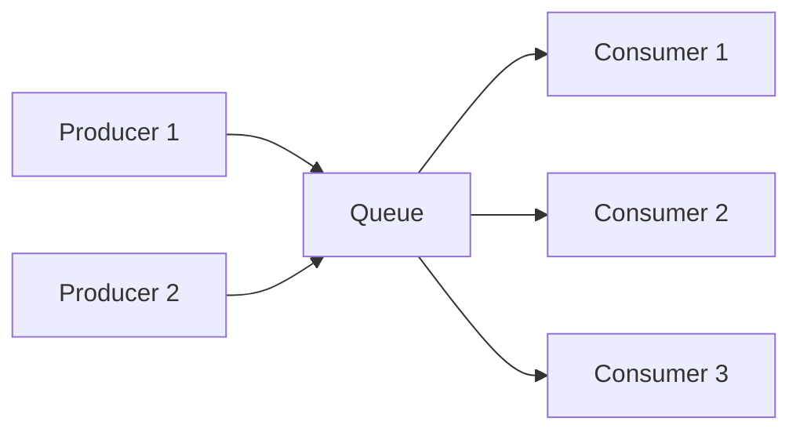

The queue distributes work among competing consumers\.

## Event Stream

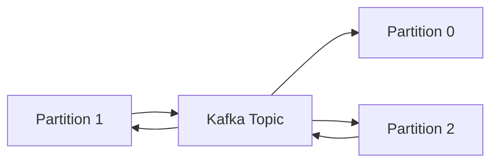

Kafka retains records according to the topic’s retention policy\. Consumers track their position using offsets\.

### Interview distinction

> A traditional queue is primarily about distributing work. An event stream is often about retaining an ordered history of events that multiple consumers can independently process or replay.

---

# 3\. Capacity Planning

Before introducing a queue, estimate the throughput requirements of both producers and consumers\.

## Producer Throughput

A simple starting estimate:

```text
Producer RPS
= number of clients × events/sec/client
```

Example:

```text
10,000 clients
× 2 events/sec
= 20,000 events/sec
```

Also estimate:

- Average throughput
- Peak throughput
- Burst duration

Example:

```text
Average:  1,000 events/sec
Peak:    10,000 events/sec
Duration: 30 seconds
```

A queue can temporarily absorb the difference between producer and consumer throughput\.

## Consumer Throughput

For a synchronous HTTP server, a useful first\-order estimate is:

```text
Throughput ≈ concurrency / average processing time
```

If each request takes 6 seconds:

```text
1 worker
= 1 / 6
≈ 0.167 requests/sec
```

With 32 concurrent workers:

```text
32 / 6
≈ 5.33 requests/sec
```

With 1,000 servers:

```text
1,000 × 5.33
≈ 5,330 requests/sec
```

This is a **theoretical estimate**, not a guarantee of actual throughput\.

Real throughput can be limited by:

- CPU
- Memory
- Database capacity
- Network bandwidth
- Connection pools
- Thread/process limits
- Lock contention
- Downstream services

### Interview talking point

> “This gives me an order-of-magnitude estimate. I’d validate the actual throughput with load testing because the application or its dependencies may become the bottleneck.”

---

# 4\. Queue Architecture

A generic architecture:

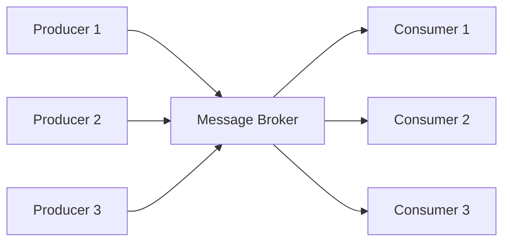

The number of producers and consumers does **not** need to match\.

Size consumers according to:

- Required throughput
- Processing latency
- Peak traffic
- Required processing delay
- Available resources

### Key relationship

```text
Producer rate > Consumer rate
        ↓
   Queue grows
        ↓
Temporary?
    ↓
Queue absorbs spike

Sustained?
    ↓
Increase capacity / throttle / optimize
```

---

# 5\. Competing Consumers vs\. Fan\-Out

## Competing Consumers

One message is processed by one consumer within the group\.

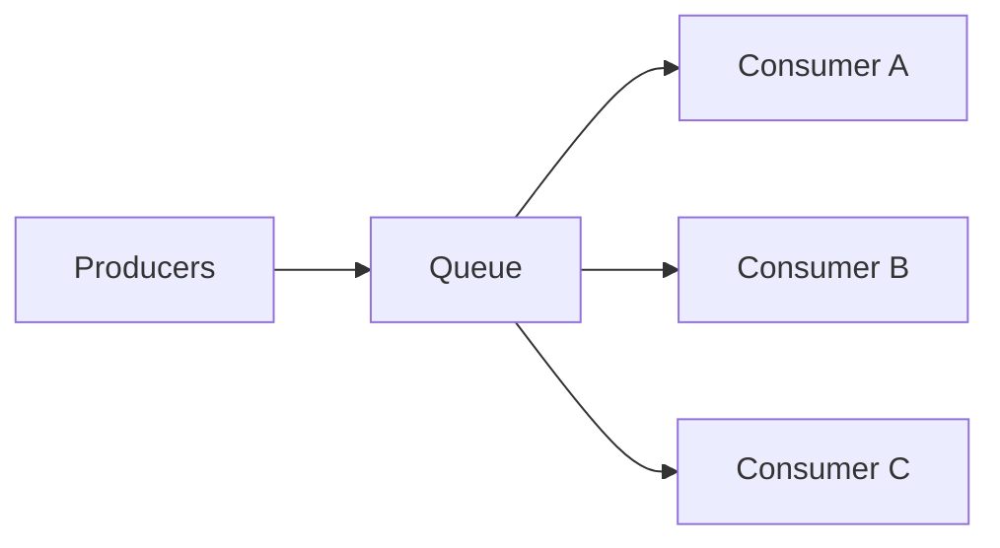

Useful for distributing work\.

Example:

```text
100 video-processing jobs
        ↓
10 workers
        ↓
Workers divide the jobs
```

## Fan\-Out

One event needs to reach multiple independent consumers\.

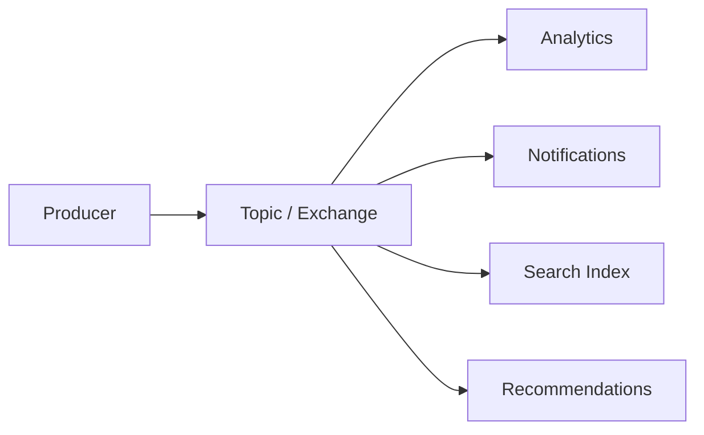

Each consumer can independently process the event\.

For Kafka, independent consumer groups can consume the same topic independently\.

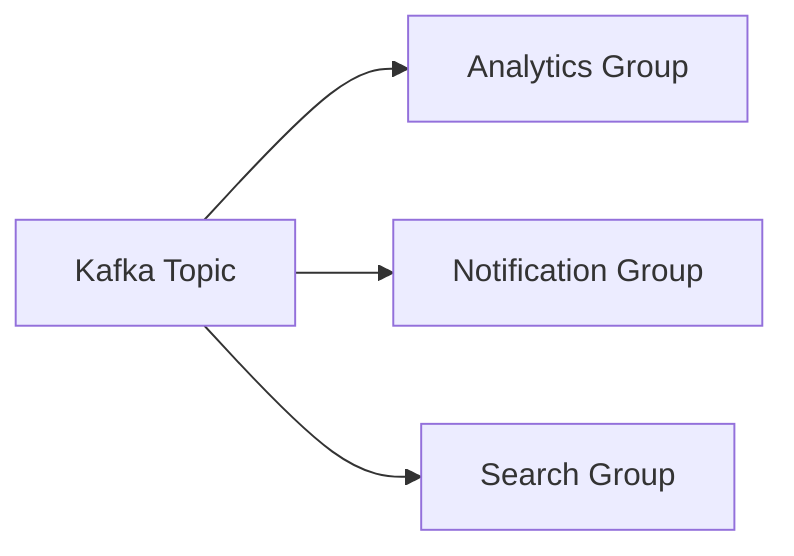

### Important

Don’t say:

> “Fan-out means waiting for all ACKs.”

Different messaging systems implement fan\-out differently\.

---

# 6\. Partitioning

Partitioning provides:

- Horizontal scalability
- Parallel processing
- Distribution across brokers
- Ordering within each partition

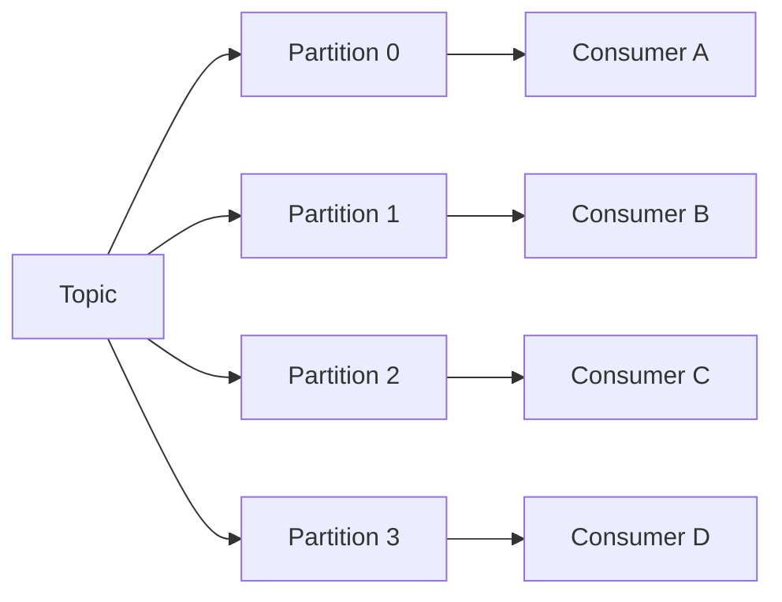

## Partition Key

Choose the key based on the ordering requirement\.

Example:

```text
partition key = user_id
```

Potential result:

```text
User A → Partition 1
User B → Partition 3
User C → Partition 0
```

This allows ordering for events belonging to the same key while distributing different keys\.

### Tradeoff: Hot Partitions

A bad partition key can create uneven distribution\.

```text
Partition 0 → 10,000 events/sec
Partition 1 →    500 events/sec
Partition 2 →    500 events/sec
Partition 3 →    500 events/sec
```

### Interview talking point

> Partition count and partition-key strategy are both scalability and ordering decisions.

---

# 7\. Consumer Groups

Kafka consumer groups allow multiple consumers to divide partitions among themselves\.

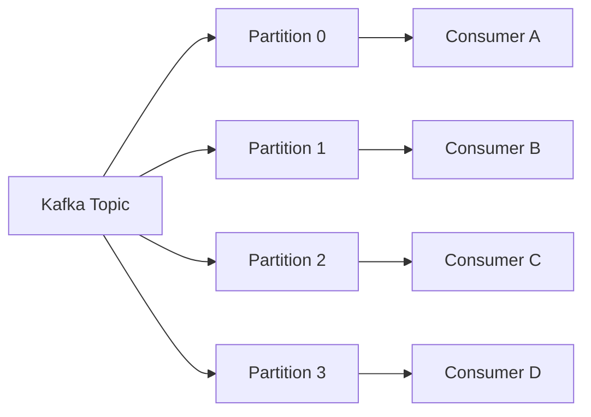

For the traditional Kafka consumer\-group model:

> A partition is assigned to one consumer within a consumer group at a time.

Therefore:

```text
Partitions = 3
Consumers  = 5

→ only 3 consumers can actively own partitions
```

Adding consumers beyond the number of partitions does not increase parallelism for that group under this model\.

### Scaling rule

```text
More partitions
    ↓
Potentially more parallelism
    ↓
More consumers can be utilized
```

But more partitions also increase:

- Operational complexity
- Metadata
- Resource usage
- Rebalancing considerations

---

# 8\. Durability

Ask:

> What happens if the broker dies?

Common durability mechanisms:

- Persist messages to disk\.
- Replicate data across brokers\.
- Configure appropriate retention\.
- Require appropriate producer confirmation\.
- Place replicas across failure domains when needed\.

## Replication

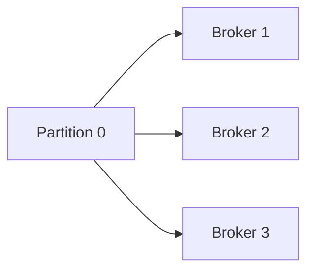

A replication factor of **3** is a common production configuration\.

It is not a universal requirement\.

### Why 3?

Three replicas can allow one replica to fail while maintaining a majority:

```text
3 replicas
    ↓
2 remaining
    ↓
majority still available
```

General majority relationship:

```text
Majority = floor(N / 2) + 1
```

Examples:

|Replicas|Majority|Failures tolerated while retaining majority|
|-------:|-------:|------------------------------------------:|
|1       |1       |0                                          |
|2       |2       |0                                          |
|3       |2       |1                                          |
|4       |3       |1                                          |
|5       |3       |2                                          |

### Important

Don’t say:

> “Kafka requires 3 nodes.”

Instead:

> “A replication factor of 3 is a common production configuration because it can tolerate one replica failure while retaining a majority, depending on the system’s quorum and availability configuration.”

Also distinguish:

```text
3 nodes
```

from:

```text
Replication factor = 3
```

A replication factor of 3 means three copies of a partition, which should be appropriately distributed across failure domains if you need to tolerate those failures\.

---

# 9\. Publisher Reliability

There are two separate reliability questions\.

## Producer → Broker

> Did the broker accept the message?

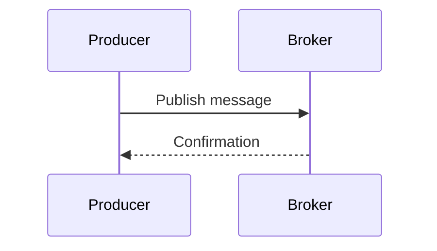

RabbitMQ uses **publisher confirms** for this\.

## Broker → Consumer

> Did the consumer successfully process the message?

These are different mechanisms\.

### Interview talking point

> Don’t use “ACK” as one generic concept. Publisher confirmation and consumer acknowledgement answer different questions.

---

# 10\. Consumer Progress

Different systems track consumer progress differently\.

## RabbitMQ

RabbitMQ supports explicit consumer acknowledgements\.

```text
Deliver
   ↓
Process
   ↓
ACK
```

If the consumer fails before acknowledging the message, the message can be redelivered\.

RabbitMQ also supports negative acknowledgements and prefetch limits\.

## Kafka

Kafka consumers track progress using offsets\.

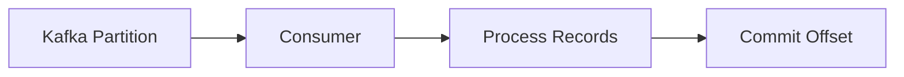

Conceptually:

```text
Partition:

[100] [101] [102] [103] [104]
                 ↑
             consumer
             position
```

The consumer can resume from its committed position\.

### Interview distinction

> RabbitMQ commonly uses acknowledgements to track individual message delivery. Kafka consumers track their position using offsets.

---

# 11\. Delivery Guarantees

## At\-Most\-Once

The message is processed zero or one time\.

```text
0 or 1 processing attempts
```

Characteristics:

- Lower reliability\-related overhead
- No duplicate processing from redelivery
- Messages can be lost
- Useful when occasional loss is acceptable

Avoid saying:

> “At-most-once always has the highest throughput.”

Better:

> “At-most-once can reduce confirmation and retry overhead, potentially improving throughput depending on the workload.”

## At\-Least\-Once

The system attempts to ensure messages aren’t lost due to unsuccessful processing, but duplicates are possible\.

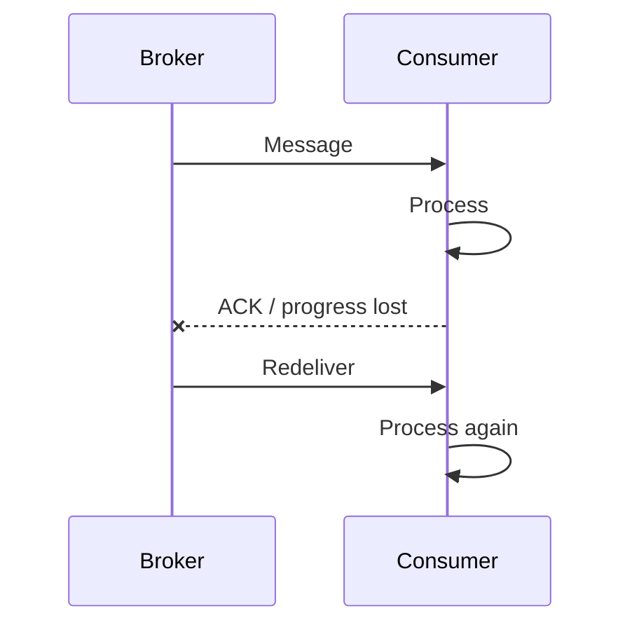

Therefore:

> At-least-once → duplicates are possible → consumers should be idempotent.

## Exactly\-Once

The goal is:

> The intended operation happens exactly once despite failures and retries.

This is significantly harder\.

Exactly\-once typically requires coordination across:

- Message processing
- State updates
- Database writes
- Offset/progress tracking
- External side effects

### Interview talking point

> Exactly-once is generally an end-to-end property, not simply a property of the message broker.

---

# 12\. Idempotency

An operation is idempotent if performing it multiple times produces the same intended result as performing it once\.

Use a unique:

- Event ID
- Transaction ID
- Idempotency key

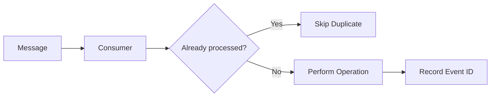

Example:

```json
{
  "event_id": "01JABC123",
  "event_type": "PaymentCreated",
  "user_id": "123",
  "amount": 500
}
```

Don’t infer uniqueness from:

```text
timestamp + payee + amount
```

Use an explicit identifier\.

### Interview talking point

> “Because we’re using at-least-once delivery, I assume duplicates are possible and make the consumer idempotent.”

---

# 13\. Exactly\-Once

Consider:

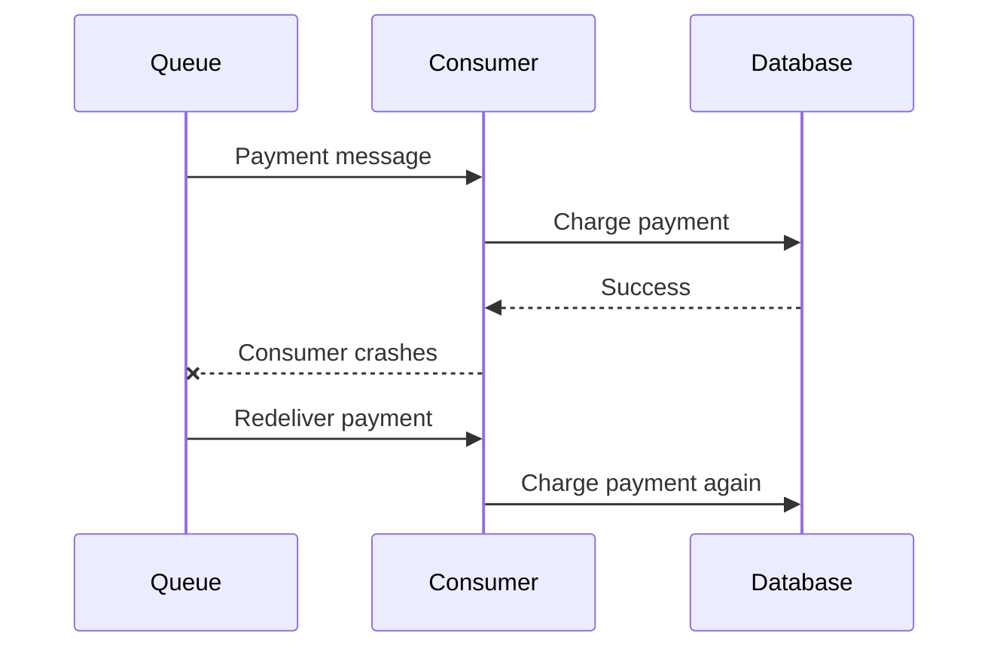

The consumer successfully performed the side effect but failed before recording progress\.

A retry can cause the side effect twice\.

Simply maintaining a “processed messages” table doesn’t automatically solve every exactly\-once problem\.

Possible approaches:

- Idempotent operations
- Database transactions
- Transactional sinks
- Atomic state updates
- Coordinated offset/state commits

Apache Flink is a useful example: exactly\-once state consistency does not automatically mean every external side effect occurs exactly once\. The source and sink also need appropriate guarantees\.

### Interview answer

> “I’d generally design for at-least-once delivery with idempotent consumers unless the requirements specifically demand stronger end-to-end exactly-once semantics.”

---

# 14\. Ordering

For Kafka:

> Ordering is guaranteed within a partition, not across the entire topic.

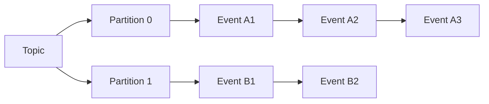

### Partition key

If events for the same user must remain ordered:

```text
partition key = user_id
```

Then:

```text
User A
Event 1 → Partition 2
Event 2 → Partition 2
Event 3 → Partition 2
```

### Tradeoff

You gain ordering for the key but risk:

- Hot partitions
- Uneven distribution
- Reduced parallelism for that key

### Interview question

Ask:

> “Do we need global ordering, ordering per user, ordering per account, or no ordering requirement?”

This can dramatically change the design\.

---

# 15\. Retries and Dead\-Letter Queues

Not every failure should immediately go to a DLQ\.

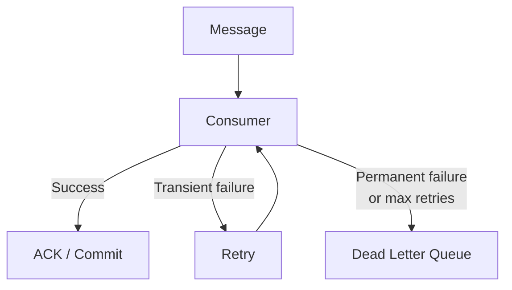

## Transient failures

Examples:

- Database temporarily unavailable
- Network timeout
- Rate limiting
- Temporary downstream outage

→ Retry

## Permanent failures

Examples:

- Invalid schema
- Malformed message
- Unsupported operation
- Invalid business data

→ DLQ

### DLQ purpose

A dead\-letter queue allows operators to:

- Inspect failures
- Identify systemic problems
- Fix the underlying issue
- Potentially replay/reprocess messages

### Retry warning

Retries can amplify an outage\.

```text
Downstream service fails
        ↓
Consumers retry
        ↓
More traffic
        ↓
Downstream gets even more overloaded
        ↓
Failure gets worse
```

Use:

- Exponential backoff
- Jitter
- Maximum retry count
- Appropriate retry queues/schedules

---

# 16\. Backpressure

If producers generate messages faster than consumers can process them:

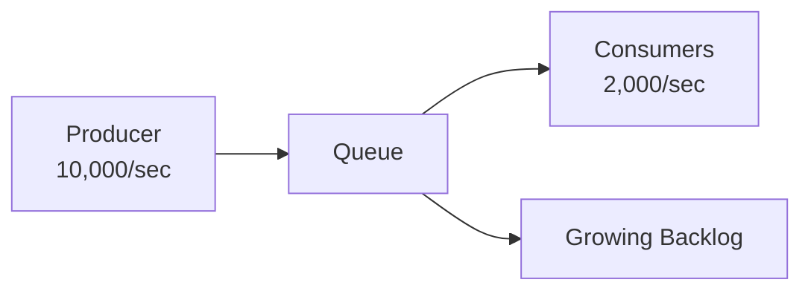

Possible responses:

- Scale consumers\.
- Increase partition count where appropriate\.
- Optimize consumer processing\.
- Throttle producers\.
- Apply backpressure\.
- Increase queue/storage capacity\.
- Shed non\-critical work if requirements allow\.

### Key distinction

```text
Temporary imbalance
    ↓
Queue absorbs spike
```

```text
Sustained imbalance
    ↓
Queue grows indefinitely
    ↓
Must change system capacity or load
```

---

# 17\. Pull vs\. Push

Don’t treat pull as universally better than push\.

## Pull

The consumer fetches messages when it is ready\.

Kafka uses a fetch/poll model\.

Benefits:

- Consumer controls fetching\.
- Natural flow control\.
- Can fetch batches\.
- Consumer controls its processing rate\.

## Push

The broker delivers messages to consumers\.

RabbitMQ commonly pushes messages to consumers\.

RabbitMQ provides **prefetch** to limit the number of outstanding unacknowledged deliveries\.

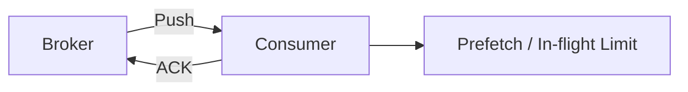

### Interview talking point

> Pull and push provide different flow-control mechanisms. The appropriate model depends on the messaging system and workload.

---

# 18\. Queue Depth and Consumer Lag

## Generic Queue

```text
Queue depth
= messages waiting to be processed
```

## Kafka

Conceptually:

```text
Consumer lag
≈ latest available offset
  − consumer's processed/committed position
```

Example:

```text
Latest offset = 10,000
Consumer offset = 9,500

Lag ≈ 500 messages
```

### Important metrics

Monitor:

- Queue depth
- Consumer lag
- Oldest message age
- Processing latency
- Producer throughput
- Consumer throughput
- Retry rate
- Error rate
- DLQ size

### Why message age matters

A queue can have a relatively small number of messages but still have a serious latency problem\.

```text
Queue depth = 100 messages
Oldest message = 30 minutes old
```

That’s potentially more concerning than:

```text
Queue depth = 100,000 messages
Oldest message = 100ms old
```

depending on the system’s requirements\.

---

# 19\. Schema Evolution

Messages should have a defined schema\.

Example:

```json
{
  "event_id": "01JABC123",
  "event_type": "UserCreated",
  "version": 1,
  "timestamp": "2026-08-24T20:00:00Z",
  "user_id": "123"
}
```

Consider:

- Schema validation
- Versioning
- Backward compatibility
- Forward compatibility
- Required vs\. optional fields
- Serialization format
- Schema registry where appropriate

### Why?

Producers and consumers can be deployed independently\.

```text
Producer v2
      ↓
Message
      ↓
Consumer v1
```

The message contract needs to remain compatible during deployments\.

---

# 20\. Observability

## Producer

Monitor:

- Publish rate
- Publish latency
- Publish failures
- Confirmation latency

## Broker

Monitor:

- CPU
- Memory
- Disk usage
- Network throughput
- Replication health
- Storage capacity

## Consumer

Monitor:

- Processing throughput
- Processing latency
- Error rate
- Retry count
- Consumer lag
- Queue depth
- Oldest message age

## DLQ

Monitor:

- DLQ size
- DLQ growth rate
- Message age
- Failure reasons

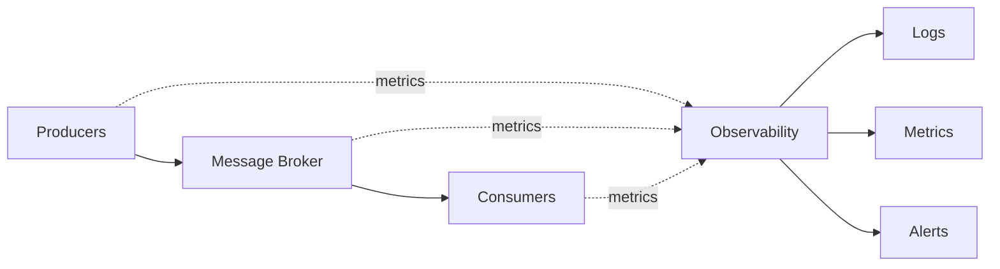

---

# 21\. Key Design Tradeoffs

|Decision              |Tradeoff                                                                                |
|----------------------|----------------------------------------------------------------------------------------|
|Synchronous HTTP      |Simple and immediate, but request latency includes processing                           |
|Asynchronous messaging|Decouples processing and absorbs bursts, but introduces asynchronous/eventual processing|
|Traditional queue     |Simple work distribution                                                                |
|Event stream          |Retention and replay, but more operational complexity                                   |
|At-most-once          |Lower reliability overhead, but messages can be lost                                    |
|At-least-once         |Better delivery reliability, but duplicates are possible                                |
|Exactly-once          |Stronger semantics, but requires coordination across processing and side effects        |
|More consumers        |Higher processing capacity, but higher resource cost                                    |
|More partitions       |More parallelism, but more complexity                                                   |
|Poor partition key    |Can create hot partitions                                                               |
|Longer retention      |Better replay/recovery, but more storage                                                |
|Pull                  |Consumer controls fetching                                                              |
|Push                  |Broker controls delivery; requires flow control                                         |
|More retries          |Better transient failure recovery, but can amplify outages                              |
|DLQ                   |Isolates poison messages, but requires operational handling                             |

---

# 22\. System Design Interview Flow

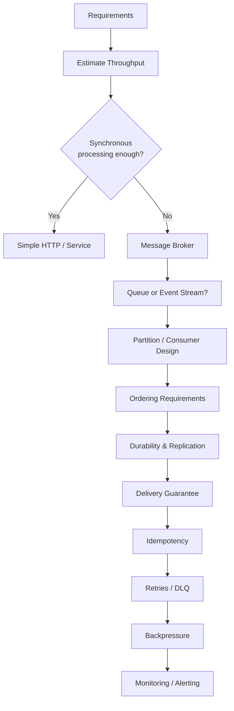

## Step 1: Requirements

Ask:

- Does the caller need the result immediately?
- Is occasional message loss acceptable?
- Do we need ordering?
- Do we need replay?
- What’s the acceptable processing delay?
- What’s the expected availability?

## Step 2: Capacity

Estimate:

```text
Producer RPS
Consumer RPS
Peak RPS
Message size
Burst duration
```

Then determine whether consumers can keep up\.

## Step 3: Choose Queue vs\. Stream

Ask:

> Is this primarily work that needs to be distributed, or an event history that multiple consumers may need to replay?

## Step 4: Scaling

Determine:

- Number of partitions
- Number of consumers
- Consumer groups
- Expected throughput per consumer
- Expected throughput per partition

## Step 5: Ordering

Ask:

> What needs to be ordered?

Possible answers:

```text
Global
Per user
Per account
Per order
Nothing
```

## Step 6: Reliability

Determine:

- Persistence
- Replication
- Producer confirmation
- Consumer progress
- Delivery semantics

## Step 7: Failure Handling

Discuss:

- Retries
- Exponential backoff
- Jitter
- Idempotency
- DLQ
- Poison messages

## Step 8: Backpressure

Ask:

> What happens if producers generate work faster than consumers can process it?

Discuss:

- Scaling consumers
- Throttling producers
- Queue capacity
- Load shedding
- Backpressure

## Step 9: Observability

Monitor:

```text
Producer throughput
Consumer throughput
Queue depth
Consumer lag
Oldest message age
Processing latency
Error rate
Retry rate
DLQ size
```

---

# 23\. Quick Reference

```text
MESSAGE QUEUE
│
├── WHY?
│   ├── Decoupling
│   ├── Async processing
│   ├── Buffering
│   ├── Independent scaling
│   ├── Failure isolation
│   └── Fan-out / replay
│
├── CAPACITY
│   ├── Producer RPS
│   ├── Consumer RPS
│   ├── Peak vs average
│   └── Burst duration
│
├── SCALING
│   ├── Consumers
│   ├── Partitions
│   └── Consumer groups
│
├── RELIABILITY
│   ├── Persistence
│   ├── Replication
│   ├── Publisher confirmation
│   └── Consumer progress
│
├── DELIVERY
│   ├── At-most-once
│   ├── At-least-once
│   └── Exactly-once
│
├── FAILURES
│   ├── Retry
│   ├── Idempotency
│   ├── DLQ
│   └── Backpressure
│
├── ORDERING
│   ├── Global?
│   ├── Per key?
│   └── Partition-level?
│
└── OPERATIONS
    ├── Queue depth
    ├── Consumer lag
    ├── Message age
    ├── Processing latency
    └── Error / DLQ rate
```

---

# 24\. One\-Page Interview Cheat Sheet

> Use this section immediately before or during interview practice. The sections above are the detailed reference.

## Message Queue — Interview Framework

### 1\. Why?

> “We need asynchronous processing because the producer doesn’t need to wait for the consumer to finish.”

```text
Producer → Broker → Consumer
```

Benefits:

- Decoupling
- Buffering
- Independent scaling
- Failure isolation
- Retry
- Fan\-out

### 2\. Capacity

Calculate:

```text
Producer RPS
= clients × events/sec/client

Consumer RPS
≈ concurrency / processing time
```

Ask:

```text
Average RPS?
Peak RPS?
Burst duration?
Message size?
Consumer processing time?
```

Key relationship:

```text
Producer RPS > Consumer RPS
        ↓
Queue grows
```

Temporary → queue absorbs it\.

Sustained → scale/optimize/throttle\.

### 3\. Queue or Event Stream?

```text
Work distribution?
    → Queue

Retained event history / replay?
    → Event stream
```

Examples:

```text
RabbitMQ → traditional queue model
Kafka    → distributed event log / stream
```

### 4\. Scaling

```text
Topic
  ↓
Partitions
  ↓
Consumers
```

More partitions → more potential parallelism\.

For Kafka consumer groups:

```text
1 partition
→ 1 active consumer in traditional group model
```

Don’t add consumers beyond available partitions expecting unlimited throughput\.

### 5\. Ordering

Ask:

> “What needs to be ordered?”

```text
Global?
Per user?
Per account?
Per order?
Nothing?
```

Kafka:

```text
Ordering guaranteed within partition
NOT across entire topic
```

Choose partition key accordingly\.

Watch for:

```text
Bad key
  ↓
Hot partition
  ↓
Uneven load
```

### 6\. Durability

Ask:

> “What happens if a broker fails?”

Consider:

- Persistent storage
- Replication
- Failure domains
- Producer confirmation
- Retention

Common configuration:

```text
Replication factor = 3
```

Why?

```text
3 replicas
→ tolerate 1 replica failure
→ still have majority
```

Don’t say:

> “Kafka requires 3 nodes.”

### 7\. Delivery Semantics

#### At\-most\-once

```text
0 or 1 processing
```

Possible loss\.

#### At\-least\-once

```text
1+ processing attempts
```

Duplicates possible\.

Therefore:

```text
At-least-once
      ↓
Idempotent consumer
```

#### Exactly\-once

Requires end\-to\-end coordination\.

> “I would prefer at-least-once + idempotency unless exactly-once semantics are explicitly required.”

### 8\. Idempotency

Use:

```text
event_id
transaction_id
idempotency_key
```

Pattern:

```mermaid
flowchart LR
    M[Message] --> C[Consumer]
    C --> D{Already processed?}

    D -->|Yes| S[Skip]
    D -->|No| W[Process]
    W --> R[Record ID]
```

### 9\. Failure Handling

```mermaid
flowchart LR
    M[Message] --> C[Consumer]

    C -->|Success| A[ACK / Commit]
    C -->|Transient failure| R[Retry]
    R --> C
    C -->|Permanent / Max retries| D[DLQ]
```

Use:

- Exponential backoff
- Jitter
- Max retries
- Idempotency
- DLQ

Watch for retry storms\.

### 10\. Backpressure

Ask:

> “What happens when consumers can’t keep up?”

Options:

```text
Scale consumers
Increase partitions
Optimize processing
Throttle producers
Apply backpressure
Increase capacity
Load shed if acceptable
```

### 11\. Monitoring

Always mention:

```text
Producer RPS
Consumer RPS
Queue depth
Consumer lag
Oldest message age
Processing latency
Error rate
Retry rate
DLQ size
```

Most important question:

> **Are consumers keeping up with producers?**

---

## 30\-Second Interview Answer

> “I’d introduce a message broker when the producer doesn’t need to wait for downstream processing. It gives us decoupling, independent scaling, and buffering for traffic spikes. I’d first calculate producer and consumer throughput and determine whether the queue needs to absorb temporary bursts. Then I’d choose between a traditional queue and an event stream based on whether we need work distribution or retained/replayable events. For scaling, I’d consider partitions and consumer groups. Then I’d clarify ordering requirements, durability and replication, delivery semantics, idempotency, retries, DLQs, backpressure, and monitoring such as consumer lag and message age.”

---

# 25\. References

## Apache Kafka

- [Apache Kafka — Design](https://kafka.apache.org/41/design/design/)
- [Apache Kafka — Consumer API](https://kafka.apache.org/41/javadoc/org/apache/kafka/clients/consumer/KafkaConsumer.html)
- [Apache Kafka — Introduction](https://kafka.apache.org/41/getting-started/introduction/)

## RabbitMQ

- [RabbitMQ — Consumer Acknowledgements & Publisher Confirms](https://www.rabbitmq.com/docs/confirms)
- [RabbitMQ — Publishers](https://www.rabbitmq.com/docs/publishers)

## Apache Flink

- [Apache Flink — Fault Tolerance Guarantees](https://nightlies.apache.org/flink/flink-docs-stable/docs/connectors/datastream/guarantees/)
- [Apache Flink — Fault Tolerance via State Snapshots](https://apache.googlesource.com/flink/+/master/docs/content/docs/learn-flink/fault_tolerance.md)

## Original References

1. https://youtu\.be/YEsP9zW1h10?is=fgQkHlEK0kCqlYCg
2. https://youtu\.be/Qay43Km1NwY?is=dkJiPT1wEU\-GUPwT
3. https://youtu\.be/1ISRd0bS714?is=659MwfSIQDGvsurV
